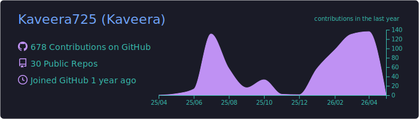
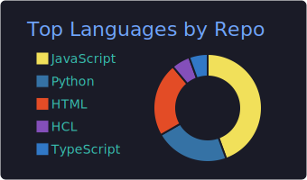
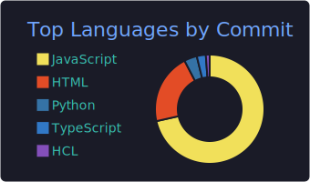
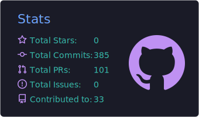
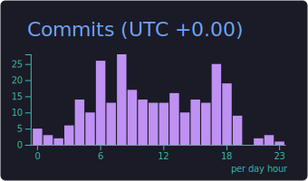

<h1 align="center">Hi 👋, I'm Anushad Kaveera</h1>
<h3 align="center">Computer Science Undergraduate at UCSC | Cloud & DevOps Enthusiast ☁️🚀</h3>

  

---

## 👨‍💻 About Me

- 🎓 Computer Science undergraduate at **University of Colombo School of Computing (UCSC)**
- ☁️ Passionate about **Cloud, DevOps, Networking & Security**
- 🔧 Love building scalable, automated systems
- 🚀 Always learning and experimenting with new technologies
- 🤝 Open to collaborations in **Cloud & DevOps projects**

---

## 🛠 Tech Stack

### 💻 Programming Languages

---

### ⚙️ Frameworks & Libraries

<!-- Gin Framework (represented by Go ecosystem) -->

---

### 🧰 DevOps & Cloud

<!-- Minikube (local Kubernetes) -->

<!-- Go ecosystem (Cloud-native tools) -->

---

## 📊 My Statistics

---

## 🌐 Connect With Me

  
  

---

## 🚀 Motto
> *“Automate everything. Secure everything. Scale everything.”*

---

⭐ If you like my work, consider following me!
